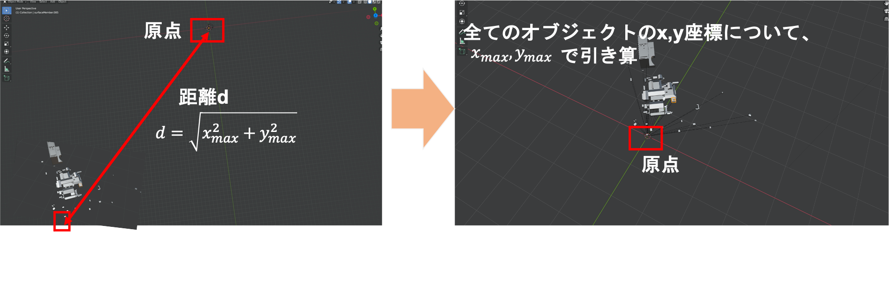

# automated_optimization_PLATEAUmodel

PLATEAUの3DCGモデルはメッシュ数やファイル数が多く、そのまま使うとVR、WebXRなどでの使用が困難です。  

このスクリプトはBlenderで読み込んだPLATEAUモデルについて、メッシュ結合とdecimate処理によるポリゴン数削減、origin to geometoryによる原点調整を自動実行します。  

---  

2022/1/23追記

このリポジトリのPythonスクリプトはfbx提供の東京都23区を前提としています。しかし、fbxで提供されているのは2022/1/23時点では東京都23区のみです。23区以外の都市データでは本スクリプトは意図した動作をしません。他の形式でも使用できる形式へは日程未定ですが対応予定です。  

参考：  
[Project PLATEAUで配布されている都市の3DCGデータ](https://www.mlit.go.jp/plateau/opendata/)

---  
# 動作確認環境

Blender 2.93.0 

# 使い方

1. Blenderで、任意のPLATEAUの3DCGモデルを開きます。

2. Scriptingを選択して、このスクリプトを読み込みます。  

3. スクリプトが表示されるので再生ボタンを実行します  

これにより、スクリプトに書かれた処理が実行され、Blenderに表示されているPLATEAUモデルのメッシュ結合、ポリゴン数削減などが実行されます。  

# スクリプトで実施されること  

・importされたemptyの中にあるmeshを結合する  

・それぞれのmeshの座標をorigin to geometoryする  

・ポリゴン数を削減する  

・原点から最も遠いオブジェクトのxとy座標の値で引き算し、全オブジェクトを原点に近づける  

補足：こうしないとUnity以外の手段でオブジェクトの位置を確認できないため   

# Tips  

PLATEAUの3DCGモデルを処理すると、多数の時間がかかります。その間Blenderが固まってしまうので、途中経過を確認したい場合は、スクリプトにprintを入れるとよいです。printで出力したログを確認するには、ログ出力をonにする必要があります。  

ログ出力をonにする方法はWindowsとMacで異なります。詳細はこちらをご確認ください。  

[Project PLATEAUの3DCGモデルをBlenderで読み込むときの進捗率を確認する方法](https://www.crossroad-tech.com/entry/PLATEAU-Blender-progress)  

# known issues

・delete_empty()を実行して、各建物のメッシュの親となっているemptyオブジェクトを削除する処理を実行すると、子であるmeshが崩れます。解決するまでは非表示にしています    

・スクリプトの処理が適用済みの状態のオブジェクトに対して、再度スクリプトの処理を適用すると、位置がおかしくなることがあります。適用は一度だけにしてください。  