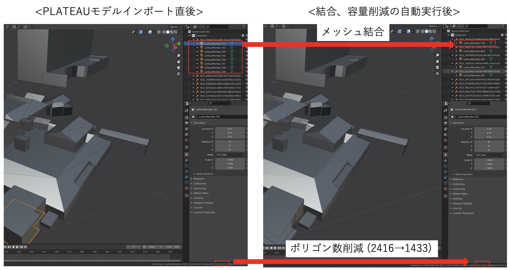

# automated_optimization_PLATEAUmodel

PLATEAUの3DCGモデルはメッシュ数やファイル数が多く、そのまま使うとVR、WebXRなどでの使用が困難です。  

このスクリプトはBlenderで読み込んだPLATEAUモデルについて、メッシュ結合とdecimate処理によるポリゴン数削減を自動実行します。

# 動作確認環境

Blender 2.93.0 