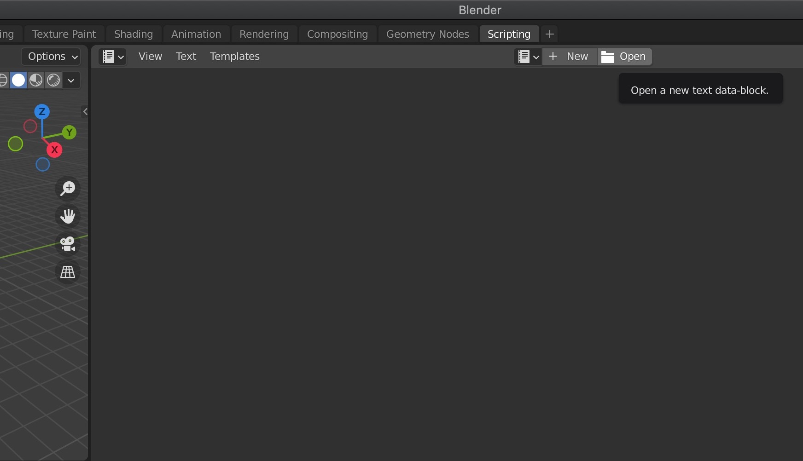
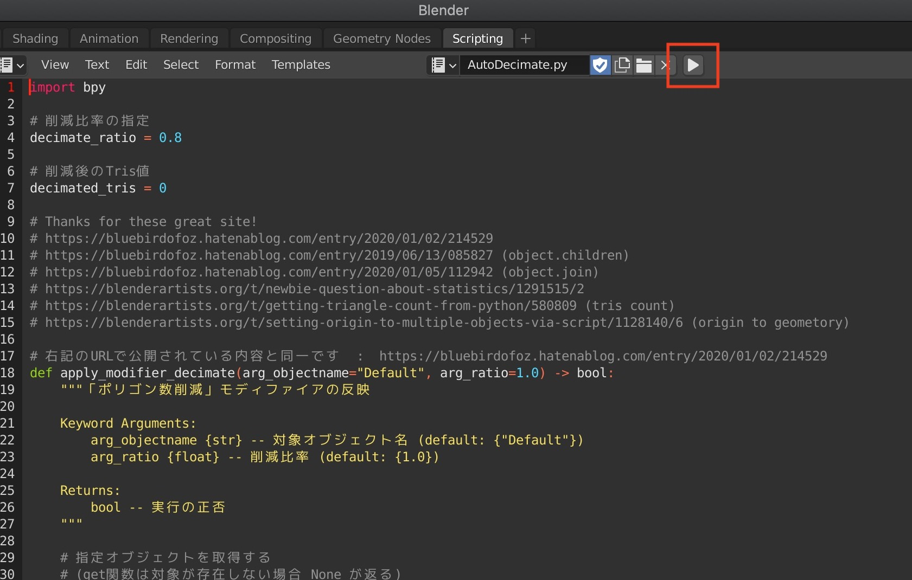

# automated_optimization_PLATEAUmodel

PLATEAUの3DCGモデルはメッシュ数やファイル数が多く、そのまま使うとVR、WebXRなどでの使用が困難です。  

このスクリプトはBlenderで読み込んだPLATEAUモデルについて、メッシュ結合とdecimate処理によるポリゴン数削減、origin to geometoryによる原点調整を自動実行します。

# 動作確認環境

Blender 2.93.0 

# 使い方

1. Blenderで、任意のPLATEAUの3DCGモデルを開きます。

2. Scriptingを選択して、このスクリプトを読み込みます。  

3. スクリプトが表示されるので再生ボタンを実行します  

これにより、スクリプトに書かれた処理が実行され、Blenderに表示されているPLATEAUモデルのメッシュ結合、ポリゴン数削減などが実行されます。  

# Tips  

PLATEAUの3DCGモデルを処理すると、多数の時間がかかります。その間Blenderが固まってしまうので、途中経過を確認したい場合は、スクリプトにprintを入れるとよいです。printで出力したログを確認するには、ログ出力をonにする必要があります。  

ログ出力をonにする方法はWindowsとMacで異なります。詳細はこちらをご確認ください。  

[Project PLATEAUの3DCGモデルをBlenderで読み込むときの進捗率を確認する方法](https://www.crossroad-tech.com/entry/PLATEAU-Blender-progress)  

# known issues

・delete_empty()を実行して、各建物のメッシュの親となっているemptyオブジェクトを削除する処理を実行すると、子であるmeshが崩れます。解決するまでは非表示にしています    
